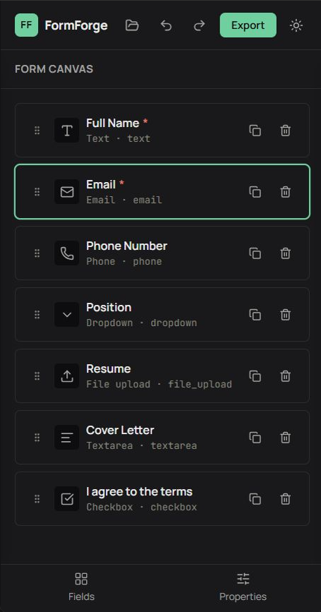

# FormForge

**Design a form visually. Generate the application behind it.**

**[Live demo →](https://formforge-ochre.vercel.app)**

FormForge is a schema-driven visual form builder and code generator. You design a form on a canvas — drag or click to add fields, configure validation, preview it live — and FormForge compiles that design into a standalone, independent project: a real HTML/CSS/JS frontend, a PHP backend with server-side validation and secure file uploads, and a MySQL schema, all downloadable as a ZIP.

It isn't a form-with-a-submit-button. The architecture is closer to a small compiler: one internal Form Schema feeds every output (preview, HTML, JavaScript, PHP, SQL, JSON Schema), so nothing is hand-authored twice and nothing can silently drift out of sync.

```
Visual Builder → Form Schema → Validation Engine → Live Preview → Code Generators → Exported Project
```

## Features

- **Visual builder** — click-to-add or drag-and-drop fields (accessible keyboard reordering via [dnd-kit](https://dndkit.com/)), 14 field types, undo/redo, a generic properties panel driven entirely by each field type's own registry entry (no per-type UI code)
- **Live preview** — a real interactive rendering of the schema, running the same validation rules the export will use, with a submission simulation (success/error states)
- **Code generation** — HTML, CSS, vanilla JavaScript, JSON Schema, a PHP REST backend, and MySQL `CREATE TABLE` SQL, each an independent, pure generator function
- **Security by construction** — every generated file escapes schema data appropriately for its target (HTML entities, `JSON.stringify`, a custom PHP literal encoder); server-side validation never trusts the client; file uploads are extension-allowlisted, MIME-sniffed, randomly renamed, and stored outside the web root; password-type fields are never persisted
- **Code viewer** — syntax-highlighted, copy/download per file, plus a Database Designer table showing the field→column mapping before you commit to it
- **Export** — a configuration dialog to include/exclude the frontend, JSON Schema, backend, and database independently, packaged as a ZIP
- **Local-first** — no account, no backend of its own; your form design autosaves to your browser and can be saved, exported as JSON, or imported back in

## Screenshots



## Architecture

```
                    ┌── HTML / CSS / JS
                    ├── JSON Schema
FORM SCHEMA ────────┼── PHP + REST API
                    ├── MySQL schema.sql
                    └── README.md
                           ↓
                        ZIP export
```

The Form Schema (`src/schema/`) is the single source of truth. Nothing downstream — the live preview, the validation engine, or any generator — maintains its own copy of field behavior; everything reads from the field registry (`src/schema/fields/`).

```
src/
  schema/        Form Schema model, field registry, reducer, import/export validation
  builder/       Visual builder — field library, canvas, properties inspector, undo/redo
  validation/    Declarative rule interpreter (required/length/range/format/pattern/file)
  preview/       Schema-driven live preview renderer
  generators/    HTML, CSS, JS, JSON Schema, PHP, SQL generators (each independent)
  export/        Export Configuration, README generation, ZIP assembly
  codeviewer/    Syntax-highlighted file browser + Database Designer
  storage/       Save/load/import/export of the FormForge design itself
  layout/        Application shell, responsive layout
  components/ui/ Shared primitives (Button, Modal, Panel, ErrorBoundary, theme)
tests/           Vitest suite: schema, validation, generators (incl. real PHP execution), export
```

## Form Schema

Every form is one JSON document — versioned (`schemaVersion`), field names constrained to a safe identifier allowlist (they become an HTML `name`, a PHP array key, and a SQL column, so they're validated once at the source rather than differently by each generator), and structurally validated on every import (a corrupt or malicious file fails with a specific, readable error, never silently or by crashing).

## Code generation

Each output format is a small, independent, pure function of `(schema) → files`. There is no single `generateEverything()` — the HTML generator doesn't know PHP exists, and vice versa. This is what makes the generators testable as what they are: a compiler pipeline, not a template-string convenience. The client-side validation (JavaScript) and server-side validation (PHP) are two separate implementations of the same declarative rules, by design — the server must never assume the browser already checked anything.

## Export system

The Export Configuration dialog gates which generators actually run — frontend, JSON Schema, backend, and database are independent toggles. A `README.md` is generated for every export, documenting exactly what was included (never claiming a capability that isn't there) plus the environment variables and security notes relevant to that specific export.

## Tech stack

React 19, Vite, plain CSS with semantic design tokens (light/dark), [@dnd-kit](https://dndkit.com/) for accessible drag-and-drop, [Prism.js](https://prismjs.com/) for code highlighting, [JSZip](https://stuk.github.io/jszip/) for client-side ZIP assembly, [Vitest](https://vitest.dev/) for testing. No backend of its own — FormForge itself is a static, local-first client application.

## Installation

```bash
git clone <this-repo>
cd FormForge
npm install
```

## Development

```bash
npm run dev      # start the dev server
npm run build    # production build
npm run lint     # oxlint
```

## Testing

```bash
npm test
```

The suite includes golden-fixture tests for four representative forms (contact form, job application, registration, customer intake), real `php -l` syntax checking and actual PHP execution of the generated backend (when a PHP CLI is available — the relevant tests skip gracefully otherwise), and a 25-field stress test.

## Security

- Every value interpolated into generated HTML is HTML-escaped; every value embedded into generated JavaScript goes through `JSON.stringify`; every value embedded into generated PHP goes through a dedicated PHP-literal encoder (never naive string concatenation)
- SQL table/column identifiers are validated against an allowlist at generation time and never built from arbitrary request data; submitted values are always bound via PDO prepared statements
- Generated file uploads are never trusted by client-declared name or MIME type — the server sniffs the real MIME type, enforces an extension allowlist plus a hardcoded dangerous-extension denylist, generates a random filename, and stores outside the web-servable root
- Password-type fields are excluded from storage entirely, in both the PHP backend and the SQL schema — a generic submissions table has no safe way to manage credentials
- This is a code generator, not a compliance product: review any generated project before handling sensitive data in production, exactly as the generated README itself says

## Roadmap

- Additional field types (multi-select, repeater sections, rich text)
- Additional backend targets (Node/Express, Laravel)
- Additional database targets (PostgreSQL)
- An AI-assisted "describe your form" schema draft (would still route through the same schema validator and require explicit user review before applying — never executed directly)

---

_FormForge is a portfolio project demonstrating schema-driven code generation, not a production SaaS product._
